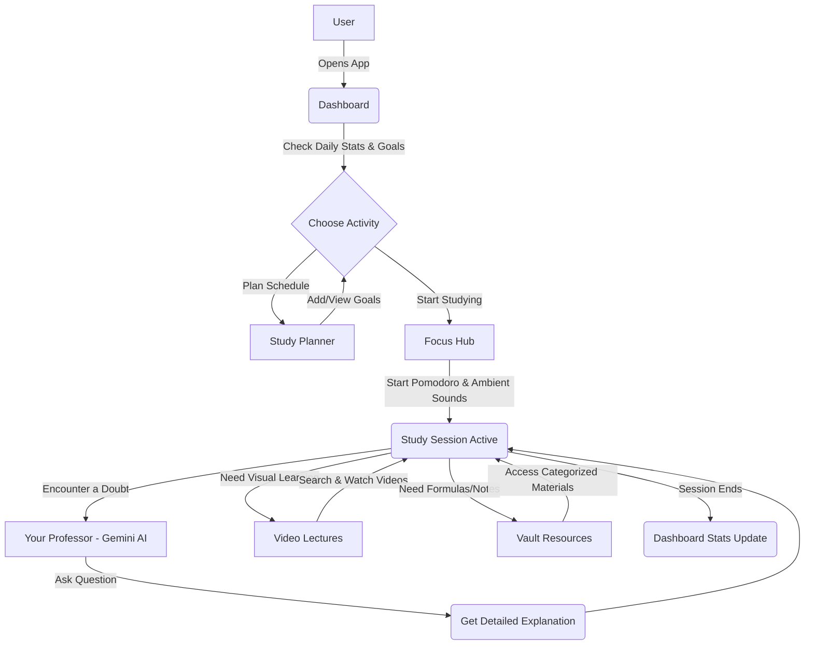

# Your Study Mentor (AI Education Mentor)

Your Study Mentor is an all-in-one AI platform designed to assist students of all levels with their academic journey. The platform combines a variety of tools like an AI-powered doubt solver (integrated with Google Gemini), a curated video lecture library, a focus hub with a Pomodoro timer and ambient sounds, a study planner, and a resource vault. 

This platform aims to make the learning process more organized, enjoyable, and efficient.

## Features

1. **Dashboard**: An overview of your day, showing planner highlights, active study sessions, and quick stats.
2. **Your Professor (AI Doubt Solver)**: A chat interface integrated with Google Gemini to answer your study-related questions in real-time.
3. **Video Lectures**: Search and filter through educational videos by topics, channels (like Physics Wallah, Khan Academy), and education levels.
4. **Focus Hub**: A distraction-free environment featuring a customizable Pomodoro timer and an ambient sound mixer (Rain, Forest, Coffee Shop, Jazz) to help you concentrate.
5. **Study Planner**: A calendar and checklist system to set and track daily study goals and events.
6. **Vault Resources**: A categorized repository of study materials, formulas, and guides for different academic levels.

## System Architecture and Workflow



## Detailed Guide

### 1. Dashboard
- **Welcome Section**: Welcomes you and shows a live clock.
- **Quick Tools**: Shows "Today's Planner Highlights" and "Active Study Session" statistics (focus intervals, doubts resolved, tasks completed).

### 2. Your Professor (Doubt Solver)
- Navigate to the **Your Professor** tab.
- Type your question in the chat input at the bottom and press the send button.
- The Google Gemini AI will provide a detailed, step-by-step explanation.
- Use the **Clear** button at the top to clear the chat history and start fresh.

### 3. Video Lectures
- Go to the **Video Lectures** tab.
- Use the search bar to find specific topics (e.g., "Newton's laws", "Algebra").
- Filter results by channel (e.g., Physics Wallah, Khan Academy, CrashCourse) or by level (Primary, High School, Competitive Exams).
- Click on a video card to play it in an immersive, distraction-free modal window.

### 4. Focus Hub
- Open the **Focus Hub** tab when you're ready to study.
- **Pomodoro Timer**: Choose a preset (25m study, 5m short break, 15m long break) or set a custom time. Click the Play button to start. 
- **Distraction-Free Mode**: Click the Fullscreen icon to expand the timer and block out distractions.
- **Ambient Soundtrack Mixer**: Play and mix background sounds (Gentle Rain, Forest Stream, Coffee Shop, Smooth Jazz) using the volume sliders to create your perfect study environment.

### 5. Study Planner
- The **Study Planner** tab provides a calendar view of the current month.
- Click **New Goal** to add a task, specifying the title and target date.
- Your tasks will appear in the checklist where you can mark them as complete as you finish them.

### 6. Vault Resources
- Access curated study materials in the **Vault Resources** tab.
- Switch between tabs to filter materials by category: Primary Classes, High School Guides, and Competitive Formulas.

## Technologies Used

- **Frontend**: HTML5, CSS3, JavaScript (Vanilla/ES6 modules)
- **UI Design**: Custom CSS (Glassmorphism, Dark Mode, Animations), Font Awesome icons
- **AI Integration**: Google Gemini API (via JavaScript backend or direct integration depending on environment)
- **Other integrations**: YouTube embedded players, HTML5 Audio API for ambient sounds.

## Local Setup

1. Clone this repository:
   ```bash
   git clone <repository_url>
   ```
2. Navigate into the directory:
   ```bash
   cd ai-education-mentor
   ```
3. Open `index.html` in any modern web browser to view the application locally. Or, if using VS Code, use the "Live Server" extension for a better development experience.
4. Ensure you have the necessary API keys configured for the AI features (e.g., Gemini API key) in your environment or JavaScript files.
